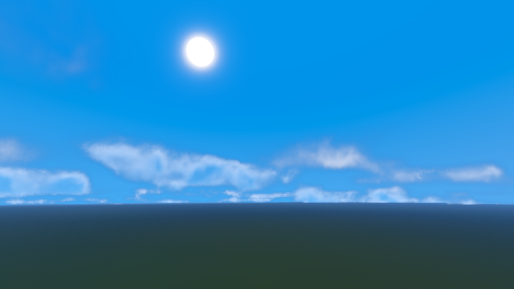
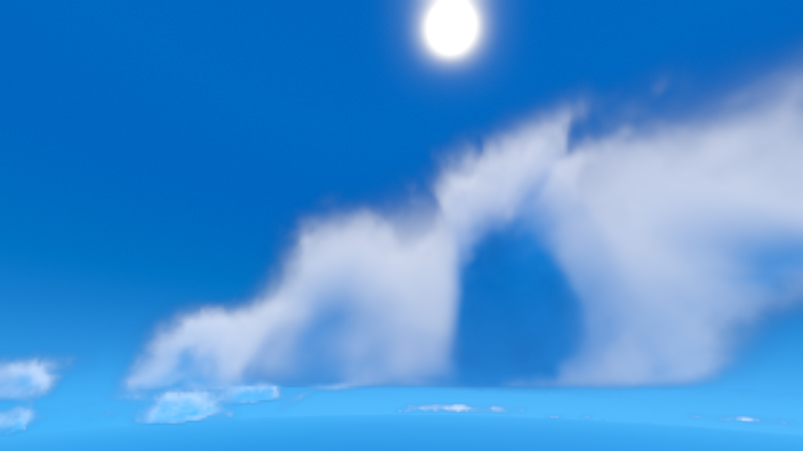
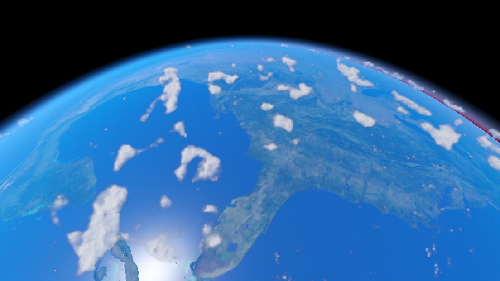
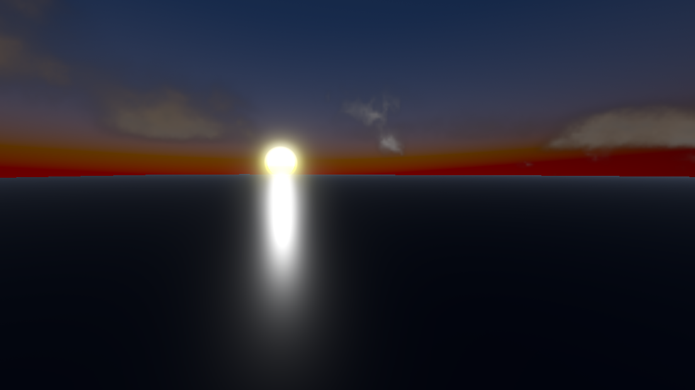
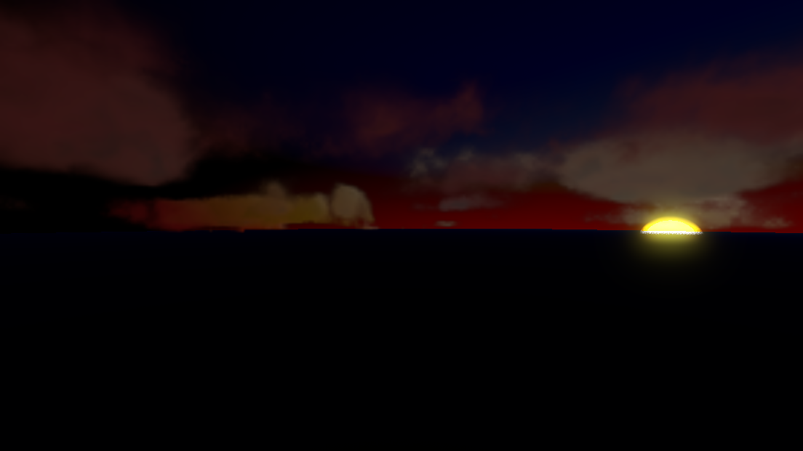
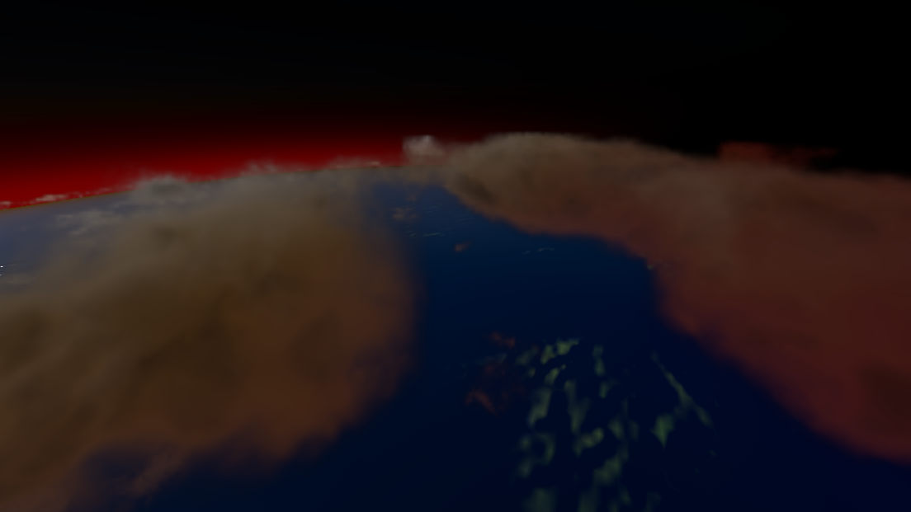
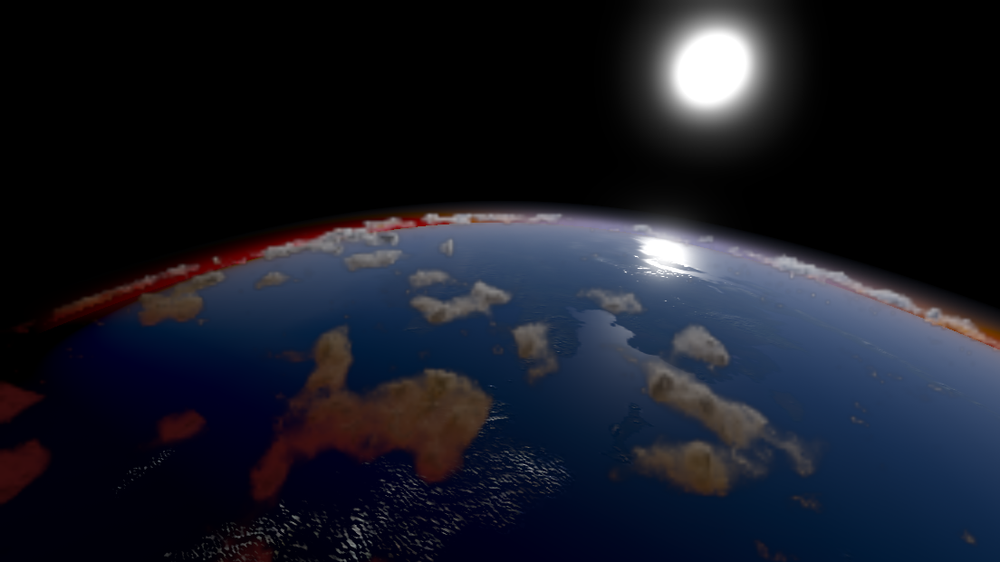
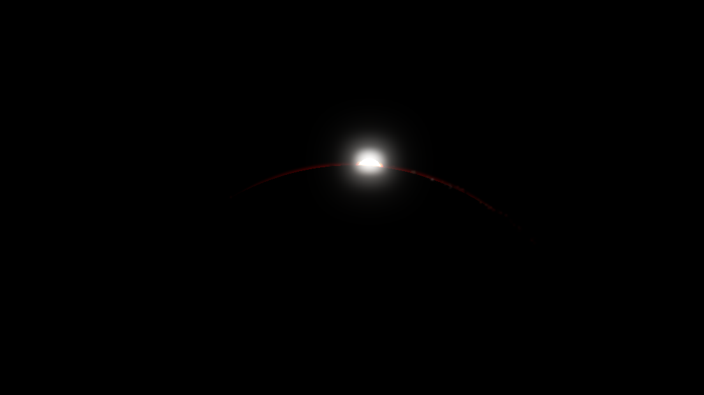

# Clouds for Little Planets (Early Release)
Godot 4.6 Cloud and Atmospheric compositor for little planets (optional flat world WIP)

* [Features](#features)
  * [Screenshots](#screenshots)
* [Install](#install)
  * [Godot AssetLib](#godot-assetlib)
  * [Direct (from GitHub)](#direct-from-github)
* [Guide](#guide)
  * [Video Guide](#video-guide)
  * [Getting Started](#getting-started)
    * [Setup](#setup)
    * [Configuring](#configuring)
    * [Saving Profiles](#saving-profiles)
    * [Script Integration](#script-integration)
* [Test](#test)
  * [Example Project](#example-project)
* [Thirdparty](#thirdparty)
* [Notable Mentions](#notable-mentions)

## Features
- Inside and out (from space) atmospheric and cloud rendering
- Volumetric cloud generation
- Profiles (for quick swapping in editor or during runtime)
  - Planet and Quality profile resources
- Time progression (WIP)
- Wind (WIP)

### Screenshots
|  |  |  |
| --- | --- | --- |
|  |  |  |
|  |  | |

## Install
### Godot AssetLib
_Release Pending..._
### Direct (from GitHub)
1) Go to [Releases](https://github.com/BinarySemaphore/clouds_little_planets/releases)
1) Download the latest `clouds_lp.zip` file
1) In Godot, ensure your project has `addons` folder
1) Click on `AssetLib` at the top
1) Find `Import...` on the top right of `AssetLib` window
1) Select the downloaded `clouds_lp.zip` file and click `Open`
1) In the "__Configure Asset Before Installing__" window, click `Change Install Folder`
1) Select `addons` folder and click `Select This Folder`
1) Click `Install`
1) From the menu-bar click `Project` > `Project Settings`
1) Select `Plugins` tab in the "Project Settings" window
1) Enable `CloudsLP`

## Guide
Clouds Little Planets (_CloudsLP_) is a compositor.
Compositors can be applied as effects onto any `WorldEnvironement` or `Camera3D` node.

### Video Guide
_In Progress..._

### Getting Started
#### Setup
1) Open or Create a 3D Scene
1) Add a `WorldEnvironment` to the node tree if one is not currently in the scene
   - Optional: configure the `Environment` > `Background` with mode _Custom Color_ and set to black for space look
1) For `WorldEnvironment` > `Compositor`, click on the `<empty>` indicator
1) Select `Compositor` to create a compositor
   - Learn more about compositors at the official Godot docs [here (4.6)](https://docs.godotengine.org/en/4.6/tutorials/rendering/compositor.html#the-compositor)
1) Click the new compositor to see `Compositor Effects`
1) Click the _Array_ to expand the effects list
1) Click `Add Element`
1) Click the _Folder-with-Plus_ icon next to `<empty>` in the effects list
1) Select `CloudsLPTemplate.tres`
   - Make sure "_Addons_" is toggled on in the selector window if you don't see anything
1) Check it's working
   - Center your viewer and zoom out to __85__ or more
   - There should be a hollow sphere with colors and cloud-like blobs
1) Right Click on the `CloudsLPTemplate.tres` and "_Make Unique_" or "_Save As_"
   - This copies the template and allows you to configure the compositor settings
   - "_Make Unique_" is like "_Save As_" but embeds it with the scene
1) Click on the effect in the effects list
   - This expands to show all configurations (where everything lives)
#### Configuring
Configuration is done in the compositor, ensure the `CloudsLP` instance is expanded (See [Setup](#setup) for details).
- Note:
  > For any profiles and other pre-loaded resources (like gradients and noise), just like with `CloudsLPTemplate.tres`,
  > it's recommended to save or make unique prior to making any changes.
  > You can always create new profiles or resources at anytime as well.
  > Nearly all parameters have hover-over hints explaining their function.

- `Flat World`: Force flat world (Y axis is altitude). `Profile.Planet.Radius` will be used as sea-level.
  - Note: `Recommend setting Radius a fraction less than geometry level (example: a plane at Y 0.0, radius should be -0.01).`
- `Light Source`: _Light3D_ node should have a unique name in scene

_In Progress..._
#### Saving Profiles
#### Script Integration

## Test
This addon repository is its own testable Godot project (Godot 4.6 | Forward+ rendering).
### Example Project
1) Download this repository
   1) Find and select `Code` at the top of GitHub
   1) Click `Download ZIP`
1) Extract project to an appropriate directory
1) Open Godot Project Manager
1) Click `Scan` or `Import` (depends on where you put the project)
1) Open the project
1) Open `test.tscn` scene
   - You should see Earth with an atmosphere and low-res clouds
   - In `WorldEnvironment` > `Compositor` > `Compositor Effects` > `0` will be `CloudsLP`
   - `CloudsLP` has all the possible configurations for both atmosphere and cloud generation
   - Any `Profile` should expand for specific configuration
1) Running the scene will use higher-res clouds and provides a controllable camera
   - Camera Controls:
     - `W A S D`: Move Forward, Left, Back, Right
     - `Q Z`: Move Up and Down
     - `Shift (hold)`: Increase movement speed
     - `Ctrl (hold)`: Decrease movement speed
     - `Arrows`: Rotate
   - Default speeds can be adjusted from the edtior prior to launching (_Move Speed_ and _Turn Speed_)

## Thirdparty
### Earth Textures:
In Test/Example project (not part of the addon)
- Source: https://www.solarsystemscope.com/textures/
- License: [Creative Commons License 4.0](https://creativecommons.org/licenses/by/4.0/)
- Files
  - `8k_earth_daymap.jpg`
  - `8k_earth_specular_map.png`
  - `8k_earth_normal_map.png`

## Notable Mentions:
- [Sunshine Clouds 2](https://github.com/Bonkahe/SunshineClouds2): Helping me learn about Godot compositors and cloud marching
