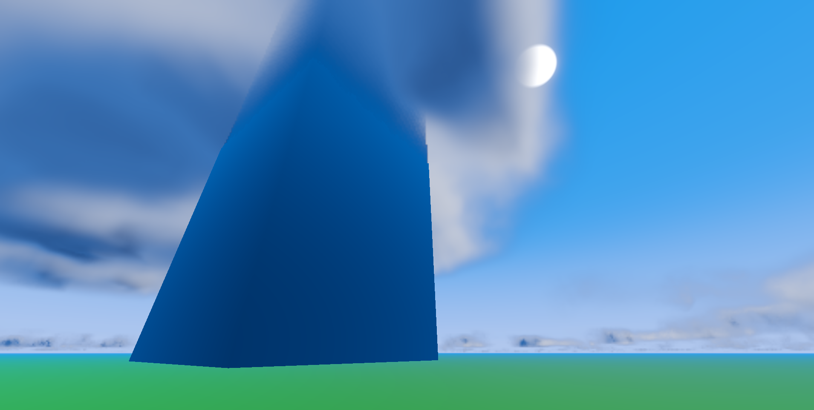
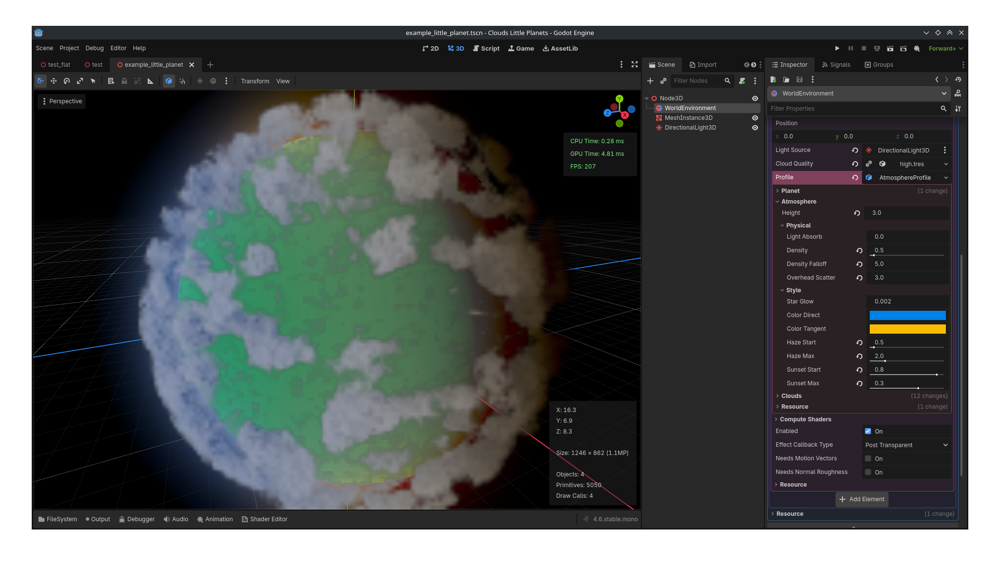

# Clouds for Little Planets (v1.0)
Atmospheric and volumetric cloud compositor for spherical and flat worlds for Godot 4.6 or later.

Native Godot editor integration with reusable Resources and organized inspector categories.

* [Features](#features)
  * [Screenshots](#screenshots)
* [Known Issues](#known-issues)
* [Install](#install)
  * [Godot AssetLib](#godot-assetlib)
  * [Direct (from GitHub)](#direct-from-github)
* [Guide](#guide)
  * [Video Guide](#video-guide)
  * [Quick Start (Example)](#quick-start-example)
  * [New Setup](#new-setup)
  * [Configuring](#configuring)
  * [Creating and Saving Profiles](#creating-and-saving-profiles)
  * [Script Integration](#script-integration)
  * [Custom Modification](#custom-modification)
* [Performance](#performance)
  * [Bench_01](#bench_01)
  * [Bench_02](#bench_02)
* [Testing](#testing)
  * [Example Project](#example-project)
* [Thirdparty](#thirdparty)
* [Notable Mentions](#notable-mentions)

## Features
- Atmospheric rendering from ground to space
- Art-specifc atmosphere controls
- Volumetric cloud generation with atmospheric lighting
- Multiple configurable cloud layers
- Scalable for large planets, toy planets, and flat worlds
- Planet and quality Resource profiles
- Time progression (cloud animation)

### Screenshots
|  |  |  |
| :---: | :---: | :---: |
|  |  |  |
|  |  | |

## Known Issues
- Embedded objects (like buildings in clouds):
  - Edges are down scaled
  - Cloud banding in some situations (near walls for dense clouds)
- Untested: Complex foreground transparency
- Untested: MSAA

## Install
### Godot AssetLib
_Release Pending..._
### Direct (from GitHub)
1) Go to [Releases](https://github.com/BinarySemaphore/clouds_little_planets/releases)
1) Download the latest `clouds_lp.zip` file
1) In Godot, Click on `AssetLib` at the top
1) Find `Import...` on the top right of `AssetLib` window
1) Select the downloaded `clouds_lp.zip` file and click `Open`
1) Click `Install`

## Guide
Clouds for Little Planets (__CloudsLP__) is a compositor.
Compositors can be applied as effects onto any `WorldEnvironement` or `Camera3D` node.

### Video Guide
[](https://youtu.be/bK4V6IIE3kU)

[https://youtu.be/bK4V6IIE3kU](https://youtu.be/bK4V6IIE3kU)

### Quick Start (Example)
1) Ensure Godot is 4.6 (native or C#) and in a `Forward+` project
1) Open Scene (navigate to `res://addons/clouds_lp` and open `example_little_planet.tscn`)
1) Zoom out to ~20m to view 10m radius little planet
1) Play with configuration
   1) Click on `WorldEnvironment`
   1) In the inspector, expand the `Componsitor` and `Compositor Effects`
   1) Click on `CloudsLP` to show settings
      - Majority of settings are under the `Profile`, for this scene it's named "_AtmoshpereProfile_"
      - Three main sections: `Planet`, `Atmosphere`, and `Clouds`
   - For more details see [Configuring](#configuring)
   - The following resources are external (shared between scenes), to modify them uniquely within this scene only, see below:
     - __Cloud Quality__: make unique by left-clicking the link icon
     - __Profile > Clouds > Noise__ (all textures): make unique by right-clicking the link icon
       - Excluding `Wisp` noise, this is a PNG file, not a Godot texture resource. It can be replaced with other curl-like noise
       - Texture resources often have subresources too, right-clicking makes the texture and it's subresources unique

### New Setup
1) Open or Create a 3D Scene
1) Add a `WorldEnvironment` to the node tree if one is not currently in the scene
   - Optional: configure the `Environment` > `Background` with mode _Custom Color_ and set to black for space look
1) For `WorldEnvironment` > `Compositor`, click on the `<empty>` indicator
1) Select `Compositor` to create a compositor
   - Learn more about compositors at the official Godot docs [here (4.6)](https://docs.godotengine.org/en/4.6/tutorials/rendering/compositor.html#the-compositor)
1) Click the new compositor to see `Compositor Effects`
1) Click the _Array_ to expand the effects list
1) Click `Add Element`
1) Click the _Folder-with-Plus_ icon next to `<empty>` in the effects list
1) Select `CloudsLPTemplate.tres`
   - Make sure "_Addons_" is toggled on in the selector window if you don't see anything
1) Check it's working
   - Center your viewer and zoom out to __85__ or more
   - There should be a hollow sphere with colors and cloud-like blobs
1) Right Click on the `CloudsLPTemplate.tres` and "_Make Unique_" or "_Save As_"
   - This copies the template and allows you to configure the compositor settings
   - "_Make Unique_" is like "_Save As_" but embeds it with the scene
1) Click on the effect in the effects list
   - This expands to show all configurations (where everything lives)

### Configuring
Configuration is done in the compositor, ensure the __CloudsLP__ instance is expanded (See [Quick Start (Example)](#quick-start-example) step __4__ for details).

The majority of settings are under __Profile__ with three main sections: __Planet__, __Atmosphere__, and __Clouds__.
__Scale Down Power__ and the __Cloud Quality__ profile resource impact performance and cloud render distance.  __Profile > Clouds > Noise Adjust > Global Scale__ automatically handles render distance, when scaled __Cloud Quality__ does not need to be adjusted (see "_Rescaling Everything ..._" below in this section).

__Cloud Quality__ and planet __Profile__ are resources which can be saved or loaded. For any external resources (like profiles, gradients, and noise textures), just like with compositor effect itself, it's recommended to save or make unique prior to making any changes.

- __Flat World__: Force flat world (Y-axis is altitude). __Position__'s Y component will be used as sea-level.
- __Light Source__: _NodePath_ to `Light3D` for illumination color and positioning.
  - Warning:
     > Godot's `CompositorEffect` is not directly in the scene tree and cannot natively resolve a _NodePath_. __CloudsLP__ resolves the _NodePath_ during initialization by locating the first named ancestor which can complete the remaining path. The resulting `Light3D` is cached during runtime. Restrictions from this limitation are documented directly in the parameter's hint/comment. Warnings and errors are given to help fix path any problems.

- Rescaling Everything While Maintaining the Same Visuals:
  - Resizing __Profile > Atmosphere > Height__ impacts mutliple visuals
  - Atmosphere density and style should automatically adjust
  - Clouds do not automatically scale with height
    - __Profile > Clouds > Noise Adjust > Global Scale__ should be changed by the same ratio as height (if height was 2 and is now 6, then global scale should be multiplied by 3)
    - For planets, scaled clouds may still look visually different if the radius of the planet did not change. This is an issue of curvature, either scale the radius (__Profile > Planet > Radius__) or individually rescale cloud layers in the __Profile > Clouds > Noise > Height__ gradient.

_In Progress..._

### Creating and Saving Profiles
__Cloud Quality__ and planet __Profile__ are Godot resource and work as any resource would in the editor.
Existing ones can be cleared and new ones can be created by clicking on the empty box.

Right click the resource or click the down-arrow next to the name, and click "Save As"

### Script Integration
The __CloudsLP__ class provides a static function *get_from_node(node: Node)*.
The function returns the first __CloudsLP__ instance in node's compositor effects.

Example:
- Where *world_env* set to a `WorldEnvironment` node
```gdscript
@export var world_env: Node

var sky_fx: CloudsLP


func _ready() -> void:
	sky_fx = CloudsLP.get_from_node(world_env)
	sky_fx.position = global_position
	sky_fx.profile.atmo_s_color_direct = Color.PLUM
```

### Custom Modification
#### Shaders
Shaders are organized into shared `*.glslinc` include files to reduce code duplication.
Most of the actual code exists in `atmo.glslinc`, `atmo_main.glslinc`, and `cloud.glslinc`.
- __Warning__:
   >Godot treats `*.glslinc` files as text substitutions. Changes to an include file do **not** automatically trigger reimport of the `*.glsl` shaders that include it. After modifying an include, manually reimport all affected `*.glsl` shaders before reloading or running the project, or the changes will not take effect.

Scene info is stored from Godot's render scene data UBO, provided in all shaders as __scene.data__ struct defined in `includes/struct_ubo_godot.glslinc`.

__CloudsLP__ specific info is writen by `clouds_lp_comp.gd` *_update_config_data()* method for the `PackedByteArray` *_config_data* (size enforced by *_alloc_longterm_data()* method).
In shaders as __config.data__ struct defined in `includes/struct_ubo_config.glslinc`.

## Performance
Frame times are measured using Godot's visual profiler for this specific compositor effect only.
### Bench_01:
- __Scene__: Earth - avg cloud coverage 2 layers
- __OS__: Linux
- __Hardware__: Nvidia GeForce RTX 2060 Max-Q (messured clock at 1.6 GHz)
- __VRAM (includes planet textures)__:
  - __Textures__: 209.6 MB
  - __Buffers__: 20.94 MB
- __Frame Times (avg)__:
  - __Settings (S1)__: 1920x1080 | Scale Down "Quarter" | Quality "High"
  - __Settings (S2)__: 1920x1080 | Scale Down "Eighth" | Quality "Medium"
    | Scenario | Times (S1) | Times (S2) |
    | --- | --- | --- |
    | Ground-to-Sky | 2.78 ms | 1.67 ms |
    | Flight | 5.18 ms | 2.19 ms |
    | Space-to-Planet | 11.96 ms | 3.18 ms |
### Bench_02:
- __Scene__: Earth - avg cloud coverage 2 layers
- __OS__: Linux
- __Hardware__: AMD Ryzen 9 4900HS with Radeon Graphics (messured clock at 1.8 GHz)
- __VRAM (includes planet textures)__:
  - __Textures__: 219.1 MB
  - __Buffers__: 20.94 MB
- __Frame Times (avg)__:
  - __Settings (S1)__: 1920x1080 | Scale Down "Quarter" | Quality "High"
  - __Settings (S2)__: 1920x1080 | Scale Down "Eighth" | Quality "Medium"
    | Scenario | Times (S1) | Times (S2) |
    | --- | --- | --- |
    | Ground-to-Sky | 12.06 ms | 6.97 ms |
    | Flight | 20.38 ms | 9.18 ms |
    | Space-to-Planet | 36.74 ms | 11.44 ms |

## Testing
This addon repository is its own testable Godot project (Godot 4.6 | Forward+ rendering).

### Example Project
1) Download this repository
   1) Find and select `Code` at the top of GitHub
   1) Click `Download ZIP`
1) Extract project to an appropriate directory
1) Open Godot Project Manager
1) Click `Scan` or `Import` (depends on where you put the project)
1) Open the project
1) Open `test.tscn` scene
   - You should see Earth with an atmosphere and low-res clouds
   - In `WorldEnvironment` > `Compositor` > `Compositor Effects` > `0` will be __CloudsLP__
   - __CloudsLP__ has all the possible configurations for both atmosphere and cloud generation
   - Any `Profile` should expand for specific configuration
1) Running the scene will use higher-res clouds and provides a controllable camera
   - Camera Controls:
     - `W A S D`: Move Forward, Left, Back, Right
     - `Q Z`: Move Up and Down
     - `Shift (hold)`: Increase movement speed
     - `Ctrl (hold)`: Decrease movement speed
     - `Arrows`: Rotate
   - Default speeds can be adjusted from the edtior prior to launching (_Move Speed_ and _Turn Speed_)
1) Additional test scenes: `test_flat.tscn` and `example_little_planet.tscn`

## Thirdparty
### Earth Textures:
In Test/Example project (not part of the addon)
- Source: https://www.solarsystemscope.com/textures/
- License: [Creative Commons License 4.0](https://creativecommons.org/licenses/by/4.0/)
- Files
  - `8k_earth_daymap.jpg`
  - `8k_earth_specular_map.png`
  - `8k_earth_normal_map.png`

## Notable Mentions:
- [Sunshine Clouds 2](https://github.com/Bonkahe/SunshineClouds2): Helping me learn about Godot compositors and cloud marching
